# Michi Sushi Granada 🍣

## Descripción
Michi Sushi Granada es una plataforma diseñada para digitalizar la experiencia del cliente y la gestión interna de un bar de sushi. Los usuarios pueden explorar la carta y realizar reservas de forma sencilla. 

El sistema incluye herramientas específicas para administradores, así como sincronización con la API dr Uber Eats.

## Objetivos
* **General:**
    * Digitalizar el sistema de reservas y la gestión de los productos.
    * Sincronización con la API de Uber Eats 

* **Específicos:**
    * Permitir el registro y gestión de perfiles de usuario, con roles.
    * Mostrar la ubicación del bar.

## Tecnologías
* **Frontend:** Typescript + Next.js + Tailwind CSS + Shadcn UI
* **Backend:** Java + Spring Boot + MongoDB

## Estado del proyecto
Fase de revisión.

## Vista previa
### Página principal


---

### Inicio de sesión con Google
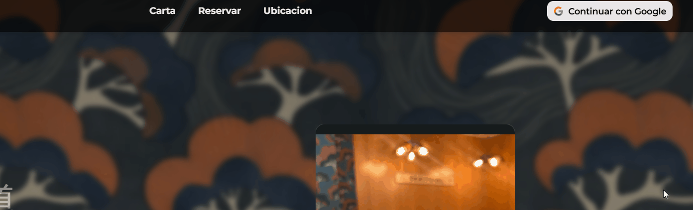

---

### Panel de usuario
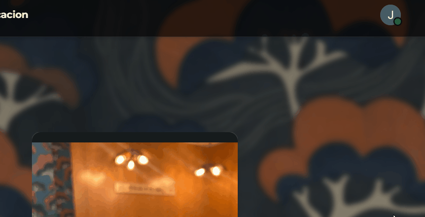

---

### Página de productos
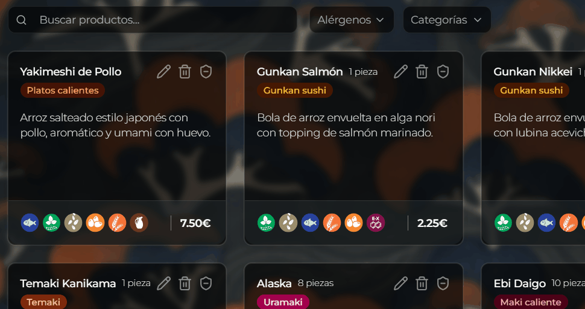

---

### Guardar productos como favoritos
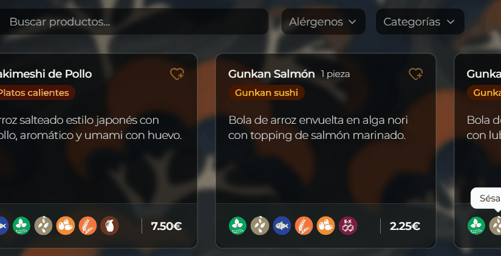

---

### Desactivar productos
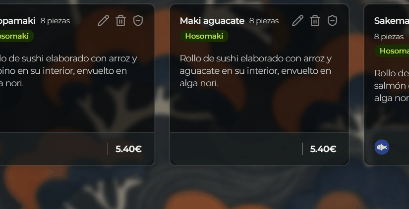

---

### Página de reservas
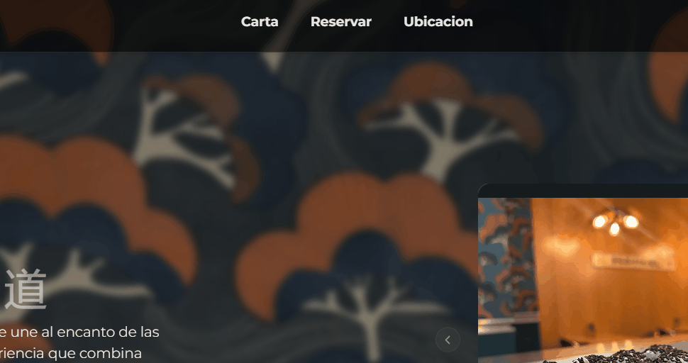

---

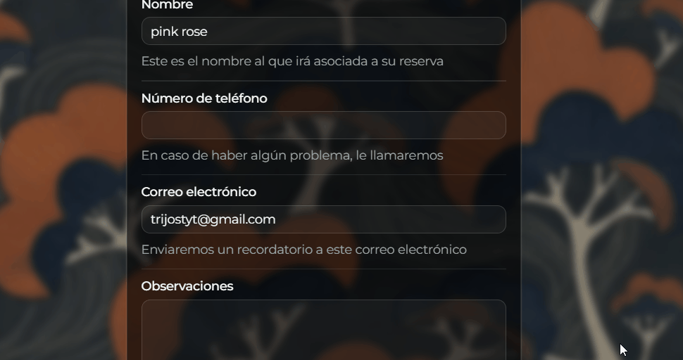

---

### Integración de Google Maps
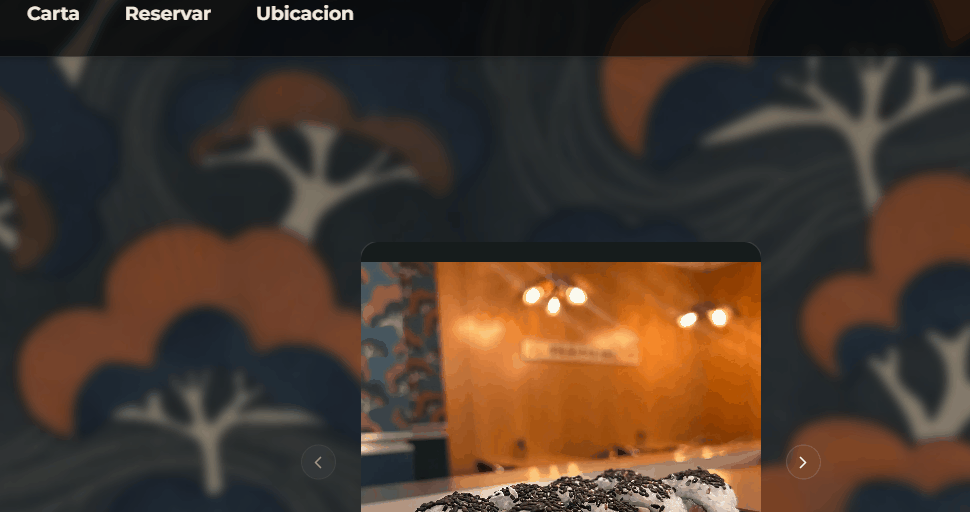

---

### Panel de administración
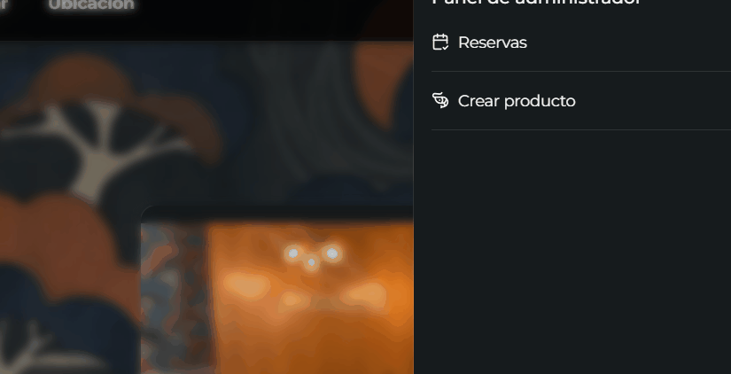

---

### Modificar y eliminar productos
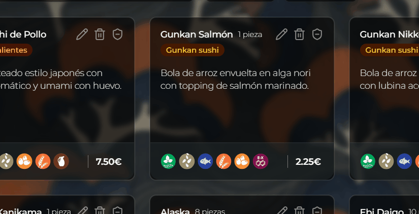

---

### Productos fuera de stock


---

### Sincronización con Uber Eats
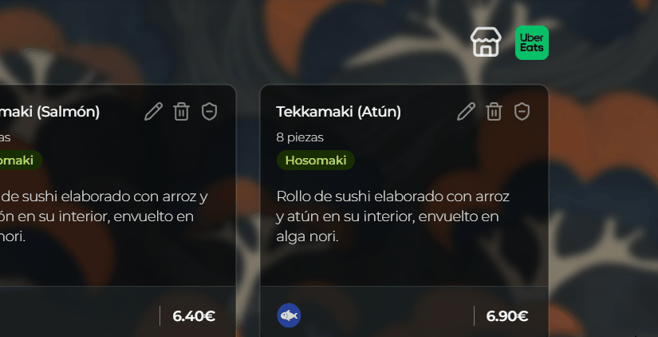

---

This is a [Next.js](https://nextjs.org) project bootstrapped with [`create-next-app`](https://nextjs.org/docs/app/api-reference/cli/create-next-app).

## Getting Started

First, run the development server:

```bash
npm run dev
# or
yarn dev
# or
pnpm dev
# or
bun dev
```

Open [http://localhost:3000](http://localhost:3000) with your browser to see the result.

